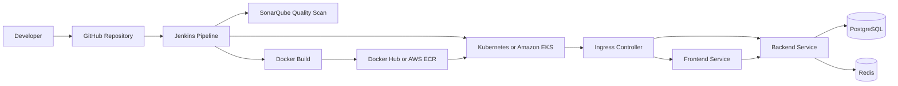

# Dockerized Microservices Deployment

A beginner-friendly but portfolio-ready DevOps project that demonstrates how to build, containerize, run, and deploy a small microservices application.

The stack includes:

- **Frontend:** nginx serving a simple HTML/CSS/JavaScript UI
- **Backend:** Python FastAPI REST API
- **Database:** PostgreSQL
- **Cache:** Redis
- **Local runtime:** Docker Compose
- **Orchestration:** Kubernetes manifests
- **Optional deployment packaging:** Helm chart

## Architecture

```text
Browser
  |
  v
Frontend Service (nginx static UI)
  |  proxies /api and /health
  v
Backend Service (FastAPI)
  |--------------------|
  v                    v
PostgreSQL         Redis
tasks table        cache hit counter
```

The frontend serves the portfolio UI and forwards API traffic to the backend. FastAPI exposes `/health`, `/api/info`, `/api/tasks`, and `/api/cache`. PostgreSQL stores demo deployment tasks, while Redis stores a small incrementing counter to prove cache connectivity.

## CI/CD Architecture



The root `Jenkinsfile` is included for a portfolio CI/CD flow with build, test, scan, image publishing, and Kubernetes deployment stages.

## Project Structure

```text
.
|-- backend/
|   |-- app/
|   |   |-- config.py
|   |   `-- main.py
|   |-- Dockerfile
|   `-- requirements.txt
|-- frontend/
|   |-- src/
|   |   |-- app.js
|   |   |-- index.html
|   |   `-- styles.css
|   |-- Dockerfile
|   `-- nginx.conf
|-- k8s/
|-- helm/
|   `-- dockerized-microservices/
|-- docs/
|   |-- SCREENSHOT_GUIDE.md
|   `-- architecture.mmd
|-- Jenkinsfile
|-- sonar-project.properties
|-- docker-compose.yml
|-- .env.example
|-- .gitignore
`-- README.md
```

## Prerequisites

- Docker Desktop or Docker Engine
- Docker Compose v2
- kubectl
- A local Kubernetes cluster such as Docker Desktop Kubernetes, minikube, or kind
- Helm 3, optional but recommended
- An ingress controller, optional for testing ingress

## Local Setup With Docker Compose

Create your local environment file:

```powershell
Copy-Item .env.example .env
```

Build and start the full stack:

```bash
docker compose up --build -d
```

Check containers:

```bash
docker compose ps
```

Verify the backend:

```bash
curl http://localhost:8000/health
curl http://localhost:8000/api/info
```

Open the app:

```text
http://localhost:3000
```

Stop the stack:

```bash
docker compose down
```

Remove local volumes if you want a clean database/cache:

```bash
docker compose down -v
```

## Kubernetes Deployment

Build local images:

```bash
docker build -t dockerized-microservices-backend:latest ./backend
docker build -t dockerized-microservices-frontend:latest ./frontend
```

If you use minikube, load the images into the cluster:

```bash
minikube image load dockerized-microservices-backend:latest
minikube image load dockerized-microservices-frontend:latest
```

Apply the manifests:

```bash
kubectl apply -f k8s/
```

Check resources:

```bash
kubectl -n dockerized-microservices get all
kubectl -n dockerized-microservices get pods -o wide
```

Wait for deployments:

```bash
kubectl -n dockerized-microservices rollout status deployment/backend
kubectl -n dockerized-microservices rollout status deployment/frontend
```

Port-forward the frontend:

```bash
kubectl -n dockerized-microservices port-forward svc/frontend 8080:80
```

Open:

```text
http://localhost:8080
```

If your cluster has an nginx ingress controller, add this host entry:

```text
127.0.0.1 microservices.local
```

Then open:

```text
http://microservices.local
```

Delete the Kubernetes resources:

```bash
kubectl delete -f k8s/
```

## Helm Deployment

Install or upgrade the chart:

```bash
helm upgrade --install dockerized-microservices ./helm/dockerized-microservices \
  --namespace dockerized-microservices \
  --create-namespace
```

Check the release:

```bash
helm status dockerized-microservices -n dockerized-microservices
kubectl -n dockerized-microservices get pods
```

Uninstall:

```bash
helm uninstall dockerized-microservices -n dockerized-microservices
```

## Verification Commands

```bash
docker compose ps
docker compose logs backend
curl http://localhost:8000/health
kubectl -n dockerized-microservices get pods
kubectl -n dockerized-microservices describe ingress microservices-ingress
kubectl -n dockerized-microservices logs deployment/backend
```

## Sample Screenshots

Add your own screenshots after running the project. A full capture guide is available in `docs/SCREENSHOT_GUIDE.md`.

1. **Docker containers running**
   - Command: `docker compose ps`
   - Suggested file: `screenshots/docker-compose-running.png`

2. **Kubernetes pods running**
   - Command: `kubectl -n dockerized-microservices get pods`
   - Suggested file: `screenshots/kubernetes-pods-running.png`

3. **App running in browser**
   - URL: `http://localhost:3000`, `http://localhost:8080`, or `http://microservices.local`
   - Suggested file: `screenshots/app-browser.png`

4. **Jenkins pipeline stages**
   - Source: root `Jenkinsfile`
   - Suggested file: `screenshots/jenkins-pipeline-stages.png`

5. **Docker Hub or AWS ECR image tags**
   - Suggested files: `screenshots/dockerhub-images.png` or `screenshots/ecr-images.png`

6. **GitHub repository and README**
   - Suggested file: `screenshots/github-repository.png`

## Environment Variables

The backend reads environment variables through `backend/app/config.py`.

| Variable | Purpose | Local default |
| --- | --- | --- |
| `APP_NAME` | Display name for the API | `Dockerized Microservices API` |
| `ENVIRONMENT` | Runtime environment label | `local` |
| `DATABASE_URL` | PostgreSQL connection URL | Set by Docker Compose/Kubernetes |
| `REDIS_URL` | Redis connection URL | `redis://redis:6379/0` |
| `ALLOWED_ORIGINS` | Comma-separated CORS origins | `http://localhost:3000,http://localhost:8000` |

For production, use a real secret manager instead of storing database passwords in plain YAML or Helm values.

## Troubleshooting

### Port already in use

Change `BACKEND_PORT` or `FRONTEND_PORT` in `.env`, then restart:

```bash
docker compose up -d
```

### Backend health is degraded

Check database and Redis logs:

```bash
docker compose logs postgres
docker compose logs redis
docker compose logs backend
```

For Kubernetes:

```bash
kubectl -n dockerized-microservices logs deployment/backend
kubectl -n dockerized-microservices describe pod -l app=backend
```

### Kubernetes image pull errors

For local clusters, build the images inside or load them into the cluster. With minikube:

```bash
minikube image load dockerized-microservices-backend:latest
minikube image load dockerized-microservices-frontend:latest
```

The manifests use `imagePullPolicy: IfNotPresent` so local images can be used.

### Ingress does not respond

Confirm you have an ingress controller installed:

```bash
kubectl get pods -A | grep ingress
```

You can always use port-forwarding while debugging:

```bash
kubectl -n dockerized-microservices port-forward svc/frontend 8080:80
```

## Push To GitHub

```bash
git init
git add .
git commit -m "Add Dockerized Microservices Deployment portfolio project"
git branch -M main
git remote add origin https://github.com/<your-username>/dockerized-microservices-deployment.git
git push -u origin main
```

## Portfolio Talking Points

- Multi-container local development with Docker Compose
- Health checks and dependency verification
- Environment-variable based configuration
- Kubernetes Deployments, Services, ConfigMaps, Secrets, PVCs, and Ingress
- Helm packaging for reusable deployments
- Clear separation between frontend, backend, database, and cache services
