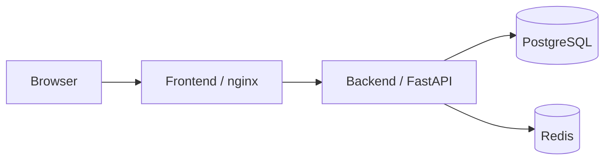
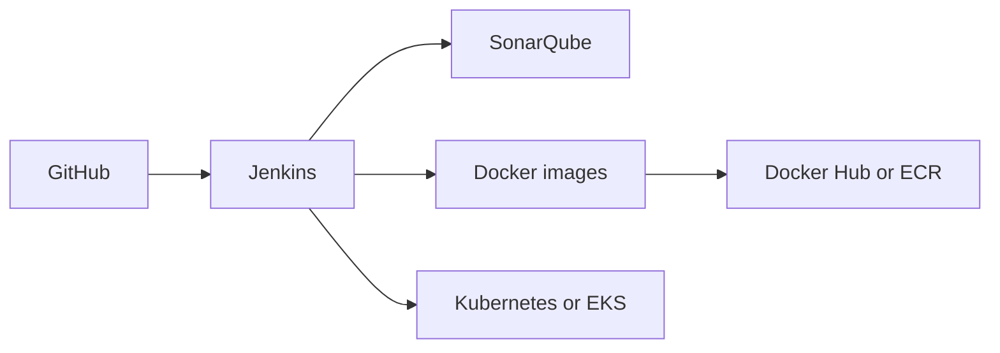

# Dockerized Microservices Deployment

A small microservices deployment project built to practice the path from local containers to Kubernetes.

The app has four services:

- `frontend`: nginx serving a static UI
- `backend`: FastAPI service with health checks
- `postgres`: stores demo tasks
- `redis`: stores a simple hit counter

The repo also includes Docker Compose, Kubernetes manifests, a Helm chart, and a Jenkins pipeline.

## Architecture



CI/CD flow:



## Repository Layout

```text
.
|-- backend/                  FastAPI service
|-- frontend/                 nginx static UI
|-- k8s/                      plain Kubernetes manifests
|-- helm/dockerized-microservices/
|-- docs/                     architecture and screenshot notes
|-- Jenkinsfile
|-- docker-compose.yml
|-- sonar-project.properties
`-- README.md
```

## Run Locally

```bash
cp .env.example .env
docker compose up --build -d
docker compose ps
```

Open the UI:

```text
http://localhost:3000
```

Check the API:

```bash
curl http://localhost:8000/health
curl http://localhost:8000/api/info
```

Stop everything:

```bash
docker compose down
```

Use `docker compose down -v` if you also want to remove the local database and Redis data.

## Jenkins Pipeline

The `Jenkinsfile` runs these stages:

1. Checkout
2. Validate
3. Build Images
4. Test
5. SonarQube
6. Docker Evidence
7. Push Images
8. Deploy to Kubernetes
9. Kubernetes Evidence

Useful parameters:

| Parameter | Purpose |
| --- | --- |
| `IMAGE_TAG` | Tag used for image build, push, and deployment |
| `RUN_SONAR` | Enables SonarQube analysis |
| `PUSH_IMAGES` | Pushes images to Docker Hub or ECR |
| `REGISTRY_TYPE` | `dockerhub` or `ecr` |
| `REGISTRY_NAMESPACE` | Docker Hub namespace |
| `DEPLOY_TO_K8S` | Runs Helm deployment |
| `UPDATE_EKS_KUBECONFIG` | Updates kubeconfig for EKS |
| `K8S_REPLICAS` | Replica count for demo deployments |

The pipeline archives command output under `pipeline-evidence/`, which is useful for portfolio screenshots.

## Kubernetes

Build local images:

```bash
docker build -t dockerized-microservices-backend:latest ./backend
docker build -t dockerized-microservices-frontend:latest ./frontend
```

For minikube:

```bash
minikube image load dockerized-microservices-backend:latest
minikube image load dockerized-microservices-frontend:latest
```

Apply manifests:

```bash
kubectl apply -f k8s/
kubectl -n dockerized-microservices get pods -o wide
kubectl -n dockerized-microservices get svc
```

Port-forward the frontend:

```bash
kubectl -n dockerized-microservices port-forward svc/frontend 8080:80
```

Open:

```text
http://localhost:8080
```

Clean up:

```bash
kubectl delete -f k8s/
```

## Helm

```bash
helm upgrade --install dockerized-microservices ./helm/dockerized-microservices \
  --namespace dockerized-microservices \
  --create-namespace
```

```bash
helm status dockerized-microservices -n dockerized-microservices
helm uninstall dockerized-microservices -n dockerized-microservices
```

## Screenshots

Use `docs/SCREENSHOT_GUIDE.md` for the exact screenshots to capture:

- Jenkins pipeline stages
- Docker images and running containers
- Kubernetes pods and services
- Docker Hub or ECR image tags
- App running in the browser

## Environment

The backend reads configuration from environment variables:

| Variable | Description |
| --- | --- |
| `APP_NAME` | API name shown in responses |
| `ENVIRONMENT` | Runtime label such as `local`, `kubernetes`, or `helm` |
| `DATABASE_URL` | PostgreSQL connection string |
| `REDIS_URL` | Redis connection string |
| `ALLOWED_ORIGINS` | Comma-separated CORS origins |

## Troubleshooting

If ports are busy, change `BACKEND_PORT` or `FRONTEND_PORT` in `.env`.

If Kubernetes pods stay pending:

```bash
kubectl -n dockerized-microservices describe pod -l app=backend
kubectl -n dockerized-microservices get events --sort-by=.lastTimestamp
```

If images cannot be pulled, confirm the image names and tags in the Helm values or Kubernetes manifests.

## Push to GitHub

```bash
git init
git add .
git commit -m "Add dockerized microservices deployment"
git branch -M main
git remote add origin https://github.com/<your-username>/dockerized-microservices-deployment.git
git push -u origin main
```
